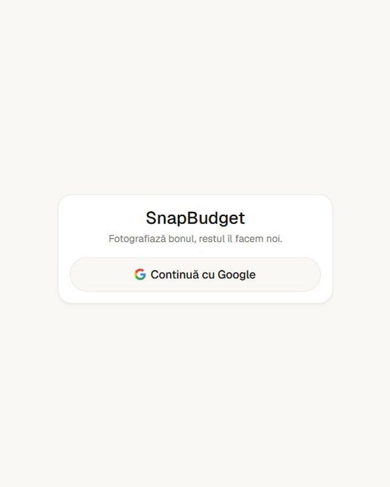
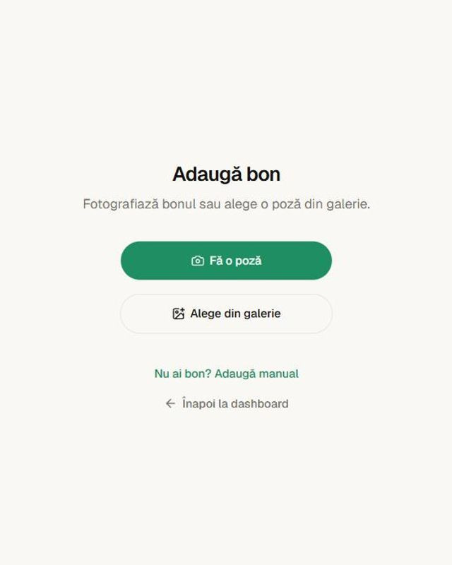
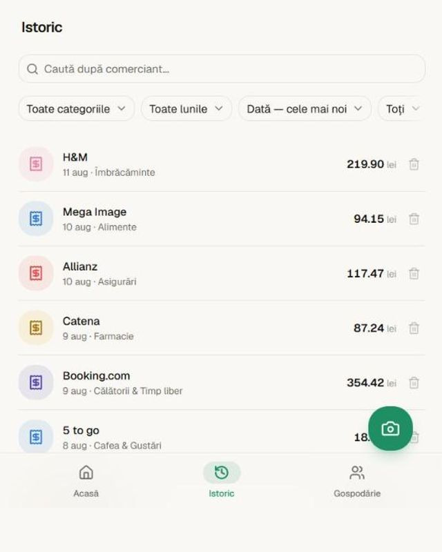
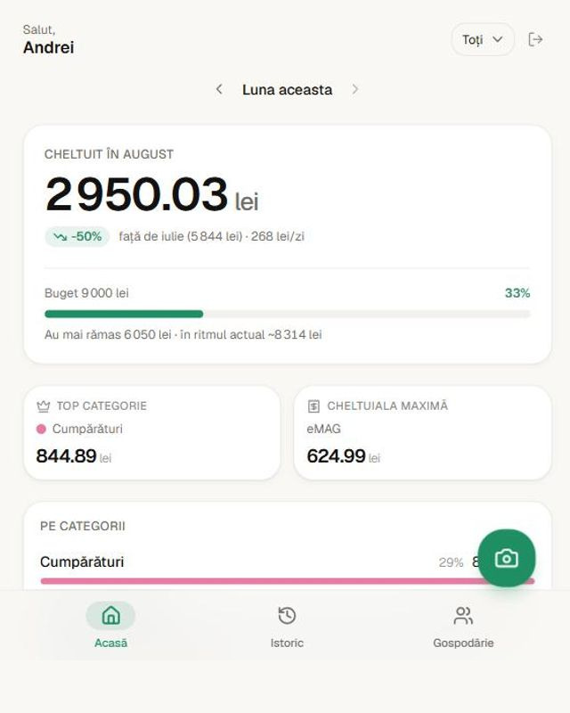
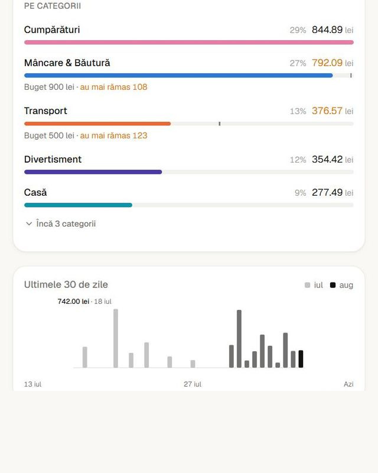
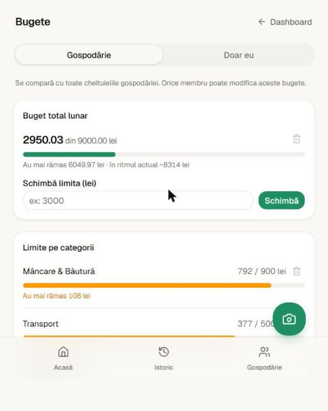
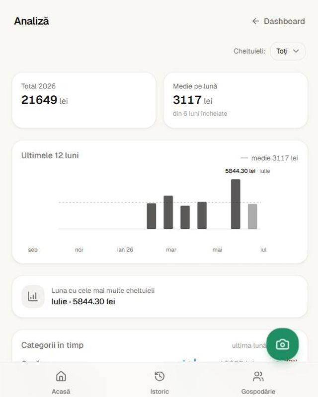
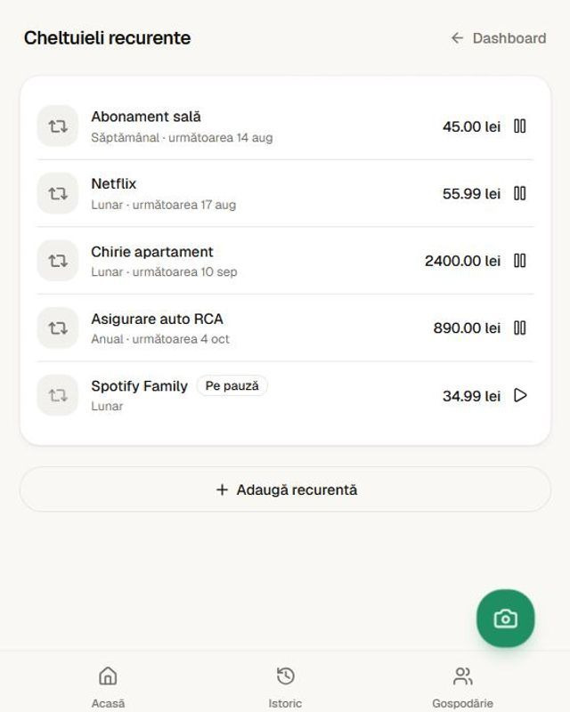
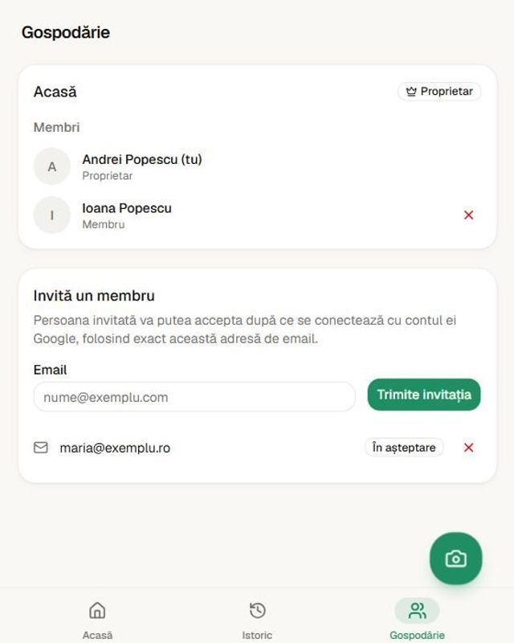

# SnapBudget

Track your expenses by photographing receipts — no manual entry. Snap a photo, OCR extracts the merchant, amount, and date, and the app auto-categorizes the spend. Expenses without a receipt (cash, parking, etc.) can be logged manually, recurring bills add themselves on a schedule, and a whole household can pool its spending into one set of totals. The dashboard surfaces month-over-month trends so spending patterns are visible at a glance, not just totals.

> The product UI is in Romanian and amounts are in lei (RON), as the screenshots show. Code, comments, and docs are in English.

## Screenshots

<table>
  <tr>
    <td align="center" width="33%">
      <br>
      <sub>Sign in with Google</sub>
    </td>
    <td align="center" width="33%">
      <br>
      <sub>Photograph or upload a receipt</sub>
    </td>
    <td align="center" width="33%">
      <br>
      <sub>Searchable, filterable history</sub>
    </td>
  </tr>
  <tr>
    <td align="center" width="33%">
      <br>
      <sub>Month total, budget &amp; categories</sub>
    </td>
    <td align="center" width="33%">
      <br>
      <sub>Category limits &amp; 30-day trend</sub>
    </td>
    <td align="center" width="33%">
      <br>
      <sub>Budgets, overall &amp; per category</sub>
    </td>
  </tr>
  <tr>
    <td align="center" width="33%">
      <br>
      <sub>12 months, average &amp; year total</sub>
    </td>
    <td align="center" width="33%">
      <br>
      <sub>Recurring rules, pause &amp; resume</sub>
    </td>
    <td align="center" width="33%">
      <br>
      <sub>Shared household &amp; invitations</sub>
    </td>
  </tr>
</table>

## Features

- **Receipt scanning** — photograph or upload a receipt; Google Vision OCR extracts merchant, amount, and date, and the spend is auto-categorized. The extraction is editable before it's saved.
- **Manual expenses** — log cash, parking, and other receipt-less spending directly.
- **Recurring expenses** — rent, subscriptions, utilities and insurance are added automatically on a weekly, monthly or yearly schedule; pause, resume, edit or delete a rule at any time. Generated rows are ordinary expenses, so they flow into the dashboard, charts and history unchanged.
- **Household sharing** — create a household and invite others by email. Everyone contributes from their own account and sees the combined totals, and the dashboard can be filtered to one member or just yourself. Owners can cancel invitations and remove members; members can leave. Access is enforced by Postgres row-level security, not just in the UI.
- **Budgets** — a monthly limit on the total and/or per category. The dashboard shows how much is used, what's left, and where the month lands at the current pace, so going over is visible days before it happens rather than after. In a household the budget can cover everyone's pooled spending or just your own; which one you see follows the same member filter as the rest of the dashboard.
- **Dashboard insights** — current vs. previous month comparison, average daily spend, top category, biggest expense, and a 30-day spending chart that shades the current month apart from the previous one. Any past month can be selected, and the whole dashboard re-scopes to it.
- **12-month analysis** — totals per month against the average, the calendar-year total, and a per-category trend showing which categories are creeping up. Summed in Postgres rather than in the app, so a year of a shared household's expenses is never pulled into memory to be added up.
- **Category breakdown** — spending by category for the current month, with a searchable category/subcategory picker when logging an expense.
- **History** — search, filter (category, month), and sort every expense, receipt or manual.
- **Google sign-in** — auth via Supabase, no separate SnapBudget password.

## Stack

- **Frontend**: Next.js (App Router) + TypeScript + Tailwind CSS + shadcn/ui
- **Backend & DB**: Supabase (Postgres + Auth + Storage), with row-level security on every table
- **Scheduling**: `pg_cron` inside Postgres — a nightly sweep generates due recurring expenses, so no service-role key is needed to run it
- **OCR**: Google Vision API
- **Payments**: Stripe — env vars are scaffolded (see below) but billing isn't wired into the product yet
- **Hosting**: Vercel

## Project structure

```
app/                  # Next.js App Router routes (dashboard, history, household, recurring, budgets, analytics, receipts)
components/           # Reusable UI components (shadcn/ui primitives under components/ui)
lib/                  # Supabase clients, OCR, categorization, dashboard aggregation
__tests__/            # Vitest unit tests for the pure date/money logic
supabase/migrations/  # SQL migrations: schema, RLS policies, pg_cron job, aggregate RPC
scripts/              # Migration runner and end-to-end RLS/recurring checks
types/                # Shared TypeScript types
docs/screenshots/     # Images used in this README
```

## Local setup

### Prerequisites

- Node.js 20+
- npm
- A Supabase project (Auth, Database, Storage enabled)
- A Google Cloud project with the Vision API enabled and a service account key
- A Stripe account (test mode is fine for development)

### 1. Install dependencies

```bash
npm install
```

### 2. Configure environment variables

Copy the example file and fill in the values:

```bash
cp .env.example .env.local
```

| Variable                                                   | Description                                                                                       |
| ---------------------------------------------------------- | ------------------------------------------------------------------------------------------------- |
| `NEXT_PUBLIC_SITE_URL`                                     | Base URL of the app (`http://localhost:3000` locally)                                             |
| `NEXT_PUBLIC_SUPABASE_URL`                                 | Supabase project URL                                                                              |
| `NEXT_PUBLIC_SUPABASE_ANON_KEY`                            | Supabase anon/public key                                                                          |
| `SUPABASE_SERVICE_ROLE_KEY`                                | Supabase service role key (server-side only, never expose to the client)                          |
| `POSTGRES_URL_NON_POOLING`                                 | Direct (non-pooled) Postgres connection string, used by `npm run db:migrate` and the test scripts |
| `GOOGLE_CLIENT_ID` / `GOOGLE_CLIENT_SECRET`                | Google OAuth credentials, wired into Supabase Auth's Google provider                              |
| `GOOGLE_VISION_CREDENTIALS_BASE64`                         | Base64-encoded Google Cloud service account JSON, used for receipt OCR                            |
| `STRIPE_SECRET_KEY` / `NEXT_PUBLIC_STRIPE_PUBLISHABLE_KEY` | Stripe API keys                                                                                   |
| `STRIPE_WEBHOOK_SECRET`                                    | Signing secret for the Stripe webhook endpoint                                                    |
| `STRIPE_PRICE_ID`                                          | Price ID for the SnapBudget subscription plan                                                     |

### 3. Apply the database migrations

Run each file in `supabase/migrations/` in filename order:

```bash
npm run db:migrate supabase/migrations/20260803140010_create_receipts.sql
```

### 4. Run the dev server

```bash
npm run dev
```

Open [http://localhost:3000](http://localhost:3000).

### Other scripts

```bash
npm run build           # Production build
npm run start           # Serve the production build
npm run lint            # ESLint
npm test                # Vitest — unit tests, single run
npm run test:watch      # Vitest in watch mode
npm run format          # Prettier — write
npm run format:check    # Prettier — check only
npm run db:migrate <f>  # Apply a single SQL migration
```

`npm test` covers the pure logic — month bucketing, the month-over-month comparison, budget pace, and the 12-month analytics — with no database needed.

Four end-to-end scripts exercise the trickier database rules against a real Supabase project. All create and delete their own temporary users, so they're safe to re-run:

```bash
npx dotenv -e .env.local -- node scripts/test-household-flow.mjs    # household sharing + RLS
npx dotenv -e .env.local -- node scripts/test-recurring-flow.mjs    # recurring date maths + generation
npx dotenv -e .env.local -- node scripts/test-budget-flow.mjs       # budget scoping, RLS + unique indexes
npx dotenv -e .env.local -- node scripts/test-analytics-flow.mjs    # monthly_spending RPC: sums, bounds, RLS
```

## Deployment

The app is deployed to [Vercel](https://vercel.com), connected to this repository. Every pull request gets a preview deployment; merges to `main` deploy to production.

Environment variables must be configured in the Vercel project settings (Production, Preview, and Development) to match `.env.example`.

## Supabase setup

1. Create a project at [supabase.com](https://supabase.com).
2. Enable the **Google** provider under Authentication > Providers, using your Google OAuth client ID/secret.
3. Create a Storage bucket for receipt images.
4. Copy the project URL and API keys into your environment variables.
5. Apply the migrations (see above). They enable the `pg_cron` extension and schedule the nightly `snapbudget-generate-recurring` sweep that mints due recurring expenses.

## Branching

`main` is protected — changes land via pull request. Preview deployments are generated automatically for every PR.
