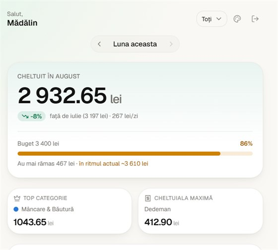
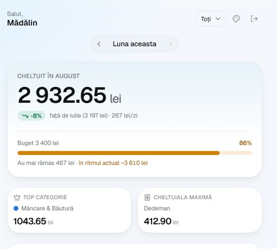
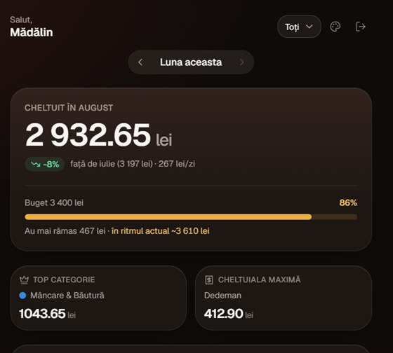
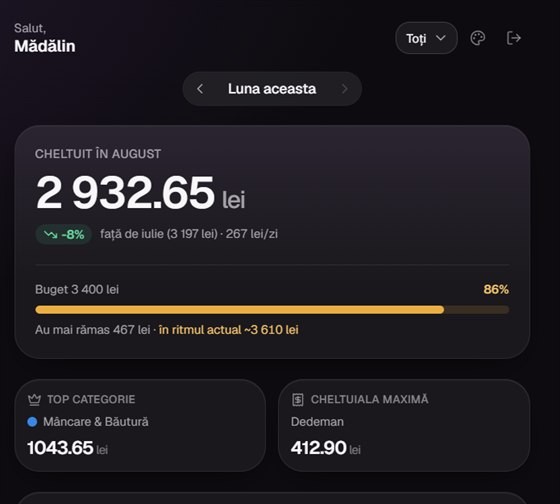

<div align="center">

# 📸 SnapBudget

**Fotografiază bonul, restul îl facem noi.**

Track spending by photographing receipts — no manual entry. Snap a photo, OCR pulls out the merchant, amount and date, and the spend categorizes itself. Cash goes in by hand, rent adds itself on a schedule, and a whole household pools into one set of totals.

### [**snapbudget.space**](https://snapbudget.space)

[Try the demo](https://snapbudget.space/demo) — invented data, no account, nothing to sign up for.

<!-- prettier-ignore -->
[](https://github.com/madalincmc/snapbudget/actions/workflows/ci.yml) [](https://nextjs.org) [](https://react.dev) [](https://www.typescriptlang.org) [](https://tailwindcss.com) [](https://supabase.com) [](https://vercel.com)

</div>

> [!NOTE]
> The product UI is in Romanian and amounts are in lei (RON), as the screenshots show.
> Code, comments and docs are in English.

---

## A look at it

<table>
  <tr>
    <td align="center" width="33%">
      <br>
      <b>The number, and whether it's a problem</b><br>
      <sub>Month total, budget, and the pace projection</sub>
    </td>
    <td align="center" width="33%">
      <br>
      <b>Where it went, day by day</b><br>
      <sub>Category limits and the 30-day trend</sub>
    </td>
    <td align="center" width="33%">
      <br>
      <b>One tap from anywhere</b><br>
      <sub>Photograph a receipt, or pick from the gallery</sub>
    </td>
  </tr>
  <tr>
    <td align="center" width="33%">
      <br>
      <b>Twelve months against your average</b><br>
      <sub>Year total, monthly mean, per-category trends</sub>
    </td>
    <td align="center" width="33%">
      <br>
      <b>Every expense, findable</b><br>
      <sub>Search, filter and sort — receipt or manual</sub>
    </td>
    <td align="center" width="33%">
      <br>
      <b>Limits that warn you early</b><br>
      <sub>Overall and per category, household or personal</sub>
    </td>
  </tr>
  <tr>
    <td align="center" width="33%">
      <br>
      <b>Bills that add themselves</b><br>
      <sub>Rent, subscriptions, utilities — pause any time</sub>
    </td>
    <td align="center" width="33%">
      <br>
      <b>One household, separate accounts</b><br>
      <sub>Invite by email, enforced by row-level security</sub>
    </td>
    <td align="center" width="33%">
      <br>
      <b>No password to forget</b><br>
      <sub>Google sign-in through Supabase</sub>
    </td>
  </tr>
</table>

### Four palettes, light and dark

The accent hue and the warmth of the neutrals move together; every surface keeps the same
lightness, so a screen tuned in one palette is tuned in all four. Category colours deliberately
_don't_ move — they identify a category, and repainting Transport because you changed accent
would break what you already learned.

<table>
  <tr>
    <td align="center" width="25%">
      <br>
      <sub><b>Smarald</b> · luminos</sub>
    </td>
    <td align="center" width="25%">
      <br>
      <sub><b>Ocean</b> · luminos</sub>
    </td>
    <td align="center" width="25%">
      <br>
      <sub><b>Apus</b> · întunecat</sub>
    </td>
    <td align="center" width="25%">
      <br>
      <sub><b>Levănțică</b> · întunecat</sub>
    </td>
  </tr>
</table>

---

## Features

- **Receipt scanning** — photograph or upload a receipt; Google Vision OCR extracts merchant, amount, and date, and the spend is auto-categorized. Nothing is written until you accept the figures, so backing out of the review leaves no expense behind.
- **Bulk upload** — a week's worth of receipts in one go: pick up to 20 photos, watch each one's status, and retry any that fail. Three run at a time, so a slow receipt doesn't hold up the rest. There's no review step here — that's the trade for not answering one per photo — and anything OCR couldn't price is flagged with a link straight to it.
- **Manual expenses** — log cash, parking, and other receipt-less spending directly.
- **Recurring expenses** — rent, subscriptions, utilities and insurance are added automatically on a weekly, monthly or yearly schedule; pause, resume, edit or delete a rule at any time. Generated rows are ordinary expenses, so they flow into the dashboard, charts and history unchanged.
- **Household sharing** — create a household and invite others by email. The invitation is actually emailed, naming the inviter and linking to a page that works signed out: through Google and back to the same invitation. Links expire after seven days and can be re-sent. Everyone contributes from their own account and sees the combined totals, and the dashboard can be filtered to one member or just yourself. Owners can cancel invitations and remove members; members can leave. Access is enforced by Postgres row-level security, not just in the UI.
- **Budgets** — a monthly limit on the total and/or per category. The dashboard shows how much is used, what's left, and where the month lands at the current pace, so going over is visible days before it happens rather than after. In a household the budget can cover everyone's pooled spending or just your own; which one you see follows the same member filter as the rest of the dashboard.
- **Dashboard insights** — current vs. previous period comparison, average daily spend, top category, biggest expense, and a 30-day spending chart that shades the current month apart from the previous one. Any past month can be selected, or an arbitrary interval — a fortnight away, the run-up to Christmas — and every figure on the screen re-scopes to it together, compared against the stretch of equal length immediately before.
- **Charts** — the daily and monthly plots share one column chart: hairline gridlines, a dashed average reference line, a direct label on the peak, and hover or arrow-key readout of any column. Category spending gets a stacked composition bar above the ranked list, with the two cross-highlighting each other.
- **12-month analysis** — totals per month against the average, the calendar-year total, and a per-category trend showing which categories are creeping up.
- **Category breakdown** — spending by category for the current month, with a searchable category/subcategory picker when logging an expense.
- **History** — search, filter and sort every expense, receipt or manual. The date filter takes named periods (this month, last 7 days, this year) or an interval you draw yourself, and the period survives searching, sorting, and opening an expense and coming back.
- **Themes and colour palettes** — an appearance menu with two independent choices: the theme (automatic / light / dark) and one of four palettes. Automatic follows the operating system and keeps following it while the app is open, and both choices survive a reload.
- **Google sign-in** — auth via Supabase, no separate SnapBudget password.

---

## Stack

| Layer          | What                                                                                                                |
| -------------- | ------------------------------------------------------------------------------------------------------------------- |
| **Frontend**   | Next.js 16 (App Router) · React 19 · TypeScript (strict) · Tailwind CSS v4 · shadcn/ui on Base UI                   |
| **Backend**    | Supabase — Postgres, Auth, Storage — with row-level security on **every** table                                     |
| **Scheduling** | `pg_cron` inside Postgres: a nightly sweep mints due recurring expenses, so no service-role key is needed to run it |
| **OCR**        | Google Vision API                                                                                                   |
| **Email**      | Resend — household invitations; the send sits behind one module, so the relay is swappable                          |
| **Payments**   | Stripe — env vars are scaffolded (see below), but billing isn't wired into the product yet                          |
| **Hosting**    | Vercel — preview per PR, production on merge to `main`                                                              |

## A few decisions worth knowing

<details>
<summary><b>Aggregation happens in Postgres, not in the app</b></summary>

The 12-month analysis calls a `monthly_spending` RPC that groups and sums in the database. A
year of a shared household's expenses is exactly the set that should never be pulled into a
serverless function to be added up there.

</details>

<details>
<summary><b>Access is enforced by RLS, not by the UI</b></summary>

Household visibility, budget scoping and every read path go through row-level security
policies. The UI filters are a convenience on top; removing them wouldn't leak a row. Five
end-to-end scripts (113 checks) exercise those policies against a real project — see
[Testing](#testing).

</details>

<details>
<summary><b>Colour is computed, not eyeballed</b></summary>

The eight category hues are validated as a categorical palette: worst adjacent pair ΔE 12.9
(light) / 10.5 (dark) under simulated deuteranopia, against a target of 8. Every `-ink` step
clears 4.5:1 as text on its own surface. Accents sit at a fixed lightness with chroma fitted to
the sRGB gamut per hue, which is what keeps white-on-accent readable in all four palettes.

Status colours (within / near / over budget) are reserved and never reused for a category —
binding "within budget" to the accent would have made the Apus palette read good → warning →
over as coral → amber → red, three warm hues with no severity gradient between them.

</details>

<details>
<summary><b>The theme is applied before the first paint</b></summary>

An inline script in `<head>` resolves the stored preference and writes `data-theme` and
`data-palette` onto `<html>` before the browser paints, so reopening the app never flashes the
wrong colours. "System" is a preference, never a rendered state — the DOM only ever carries a
concrete `light` or `dark`, so CSS never has to express "follow the OS".

</details>

<details>
<summary><b>No chart hides its numbers behind a pointer</b></summary>

Every chart renders a visually hidden table of the same values alongside the plot, and columns
are reachable with the arrow keys. All motion is switched off wholesale under
`prefers-reduced-motion`.

</details>

## Project structure

```
app/                  # App Router routes (dashboard, history, household, recurring, budgets, analytics, receipts)
app/globals.css       # Design tokens: the four palettes, category + status colours, motion primitives
components/           # UI components — shadcn/ui primitives in components/ui, plots in components/charts
lib/                  # Supabase clients, OCR, categorization, dashboard aggregation, email, theme
__tests__/            # Vitest unit tests for the pure date/money/parsing logic
e2e/                  # Playwright browser tests
supabase/migrations/  # SQL: schema, RLS policies, pg_cron job, aggregate RPC
scripts/              # Migration runner and end-to-end RLS/recurring checks
types/                # Shared TypeScript types
docs/screenshots/     # Images used in this README
```

## Local setup

### Prerequisites

- Node.js 20+
- npm
- A Supabase project (Auth, Database, Storage enabled)
- A Google Cloud project with the Vision API enabled and a service account key
- A Stripe account (test mode is fine for development)

### 1. Install dependencies

```bash
npm install
```

### 2. Configure environment variables

Copy the example file and fill in the values:

```bash
cp .env.example .env.local
```

<details>
<summary><b>What each variable is for</b></summary>

| Variable                                                   | Description                                                                                                         |
| ---------------------------------------------------------- | ------------------------------------------------------------------------------------------------------------------- |
| `NEXT_PUBLIC_SITE_URL`                                     | Base URL of the app (`http://localhost:3000` locally)                                                               |
| `NEXT_PUBLIC_SUPABASE_URL`                                 | Supabase project URL                                                                                                |
| `NEXT_PUBLIC_SUPABASE_ANON_KEY`                            | Supabase anon/public key                                                                                            |
| `SUPABASE_SERVICE_ROLE_KEY`                                | Supabase service role key (server-side only, never expose to the client)                                            |
| `POSTGRES_URL_NON_POOLING`                                 | Direct (non-pooled) Postgres connection string, used by `npm run db:migrate` and the test scripts                   |
| `GOOGLE_CLIENT_ID` / `GOOGLE_CLIENT_SECRET`                | Google OAuth credentials, wired into Supabase Auth's Google provider                                                |
| `GOOGLE_VISION_CREDENTIALS_BASE64`                         | Base64-encoded Google Cloud service account JSON, used for receipt OCR                                              |
| `RESEND_API_KEY` / `EMAIL_FROM`                            | Invitation email. Leave unset and invitations are still created — only the email is skipped, and the screen says so |
| `STRIPE_SECRET_KEY` / `NEXT_PUBLIC_STRIPE_PUBLISHABLE_KEY` | Stripe API keys                                                                                                     |
| `STRIPE_WEBHOOK_SECRET`                                    | Signing secret for the Stripe webhook endpoint                                                                      |
| `STRIPE_PRICE_ID`                                          | Price ID for the SnapBudget subscription plan                                                                       |

</details>

### 3. Apply the database migrations

Run each file in `supabase/migrations/` in filename order:

```bash
npm run db:migrate supabase/migrations/20260803140010_create_receipts.sql
```

### 4. Run the dev server

```bash
npm run dev
```

Open [http://localhost:3000](http://localhost:3000).

### Other scripts

```bash
npm run build           # Production build
npm run start           # Serve the production build
npm run lint            # ESLint
npm test                # Vitest — unit tests, single run
npm run test:watch      # Vitest in watch mode
npm run test:e2e        # Playwright — browser end-to-end tests
npm run format          # Prettier — write
npm run format:check    # Prettier — check only
npm run db:migrate <f>  # Apply a single SQL migration
```

## Testing

**`npm test`** covers the pure logic — period bucketing and comparison, budget pace, the 12-month
analytics, receipt parsing, date-range resolution, batch queueing, invitation expiry and email
canonicalisation — 243 tests, no database needed. CI runs it on every pull request alongside
format, lint, types and a full build.

**Five end-to-end scripts** (113 checks) exercise the database rules against a real Supabase
project, driven through the Data API as real signed-in users — so a policy mistake surfaces here
rather than in production. All create and delete their own temporary users, so they're safe to
re-run:

```bash
npx dotenv -e .env.local -- node scripts/test-household-flow.mjs           # sharing, invitations + RLS
npx dotenv -e .env.local -- node scripts/test-household-spending-flow.mjs  # pooled totals per member
npx dotenv -e .env.local -- node scripts/test-recurring-flow.mjs           # recurring date maths + generation
npx dotenv -e .env.local -- node scripts/test-budget-flow.mjs              # budget scoping, RLS + unique indexes
npx dotenv -e .env.local -- node scripts/test-analytics-flow.mjs           # monthly_spending RPC: sums, bounds, RLS
```

> [!IMPORTANT]
> These stay out of CI on purpose: they need the service-role key and write to a live database,
> and on a public repository that key would have to live in Actions secrets. Run them by hand
> before merging anything that touches `supabase/migrations/`.

**`npm run test:e2e`** drives the real app in a real browser with [Playwright](https://playwright.dev)
— starting logged out, signing in, and clicking through the app the way a user would. Real Google
sign-in can't be scripted (no password gets typed on its behalf), so login is seeded instead: the
test asks Supabase's admin API for a magic-link token for a dedicated `e2e-playwright@` account and
redeems it at `app/api/test/login`, which 404s outside `next dev` and only ever exists locally. That
route calls the same `auth.verifyOtp` a clicked email link would, through the app's own cookie
plumbing, so the resulting session is real — everything downstream of login runs unmodified. The
test account is wiped of its own data after every run and never touches a real user's.

Same live-database caveat as the RLS scripts above — needs `SUPABASE_SERVICE_ROLE_KEY`, stays out
of CI, run by hand:

```bash
npm run test:e2e
```

## Deployment

Production is **[snapbudget.space](https://snapbudget.space)**, on [Vercel](https://vercel.com) and
connected to this repository. Every pull request gets a preview deployment; merges to `main` deploy
to production. The apex redirects to `www`, which is the canonical host.

Environment variables must be configured in the Vercel project settings (Production, Preview, and Development) to match `.env.example`.

> [!IMPORTANT]
> Preview deployments share the **production** database — they are not an isolated environment.
> Anything written while testing a pull request is written for real.

> [!NOTE]
> The host appears outside this repo as well, and nothing here checks that the copies agree:
> Supabase Auth's Site URL and redirect allow-list, `NEXT_PUBLIC_SITE_URL`, and the Resend sending
> domain. Changing the domain without updating all of them fails quietly — an unlisted redirect
> sends sign-ins back to the old host, and a missing site URL creates invitations that send no
> email.

## Supabase setup

1. Create a project at [supabase.com](https://supabase.com).
2. Enable the **Google** provider under Authentication > Providers, using your Google OAuth client ID/secret.
3. Under Authentication > URL Configuration, set the **Site URL** to the host the app is served on
   and add it to the **Redirect URLs** allow-list. Supabase silently falls back to the Site URL
   when `redirectTo` is not allow-listed, which sends sign-ins to the wrong host and reads as a
   button that did nothing.
4. Create a Storage bucket for receipt images.
5. Copy the project URL and API keys into your environment variables.
6. Apply the migrations (see above). They enable the `pg_cron` extension and schedule the nightly `snapbudget-generate-recurring` sweep that mints due recurring expenses.

## Branching

`main` is protected — changes land via pull request. Every PR gets a preview deployment and a
full CI run; merging to `main` deploys to production.

---

<div align="center">
<sub>Built with Next.js, Supabase and a lot of receipts.</sub>
</div>
